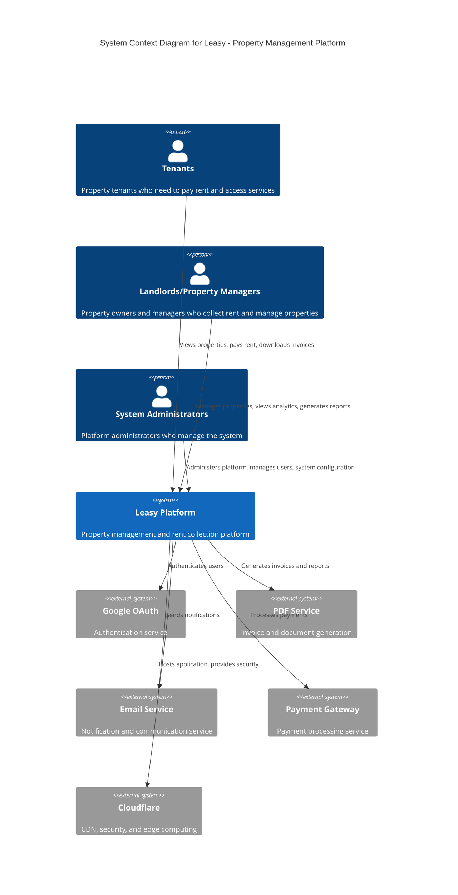
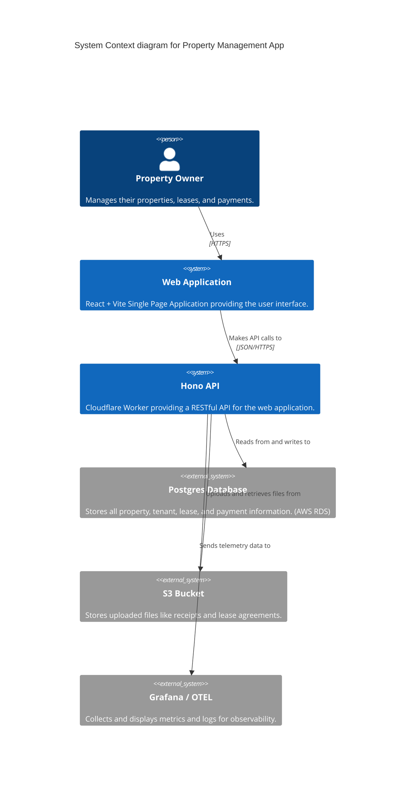

# Leasy - Invoice Generator

A modern invoice generator web app for commercial building owners managing multiple tenants.

```txt
npm install
npm run dev
```

```txt
npm run deploy
```

[For generating/synchronizing types based on your Worker configuration run](https://developers.cloudflare.com/workers/wrangler/commands/#types):

```txt
npm run cf-typegen
```

Pass the `CloudflareBindings` as generics when instantiation `Hono`:

```ts
// src/index.ts
const app = new Hono<{ Bindings: CloudflareBindings }>()
```

## Features

✅ **Dashboard** - View building metrics and tenant data
✅ **Invoice Generation** - Create invoices for tenants
✅ **Modern UI** - Clean interface with Tailwind CSS
⬜ **Real Authentication** - Currently mock login only
⬜ **Real PDF Export** - Currently mock PDF only
⬜ **Multi-building** - Currently single building only

MVP includes mock auth and single building support.

## Tech Stack

| Category | Technology | Purpose | Documentation |
|----------|------------|---------|---------------|
| **Frontend** | [TypeScript](https://www.typescriptlang.org/docs/) | Type safety & development experience | [Official Docs](https://www.typescriptlang.org/docs/) |
| | [React 19](https://react.dev/) | UI framework | [Official Docs](https://react.dev/) |
| | [TanStack Query](https://tanstack.com/query/latest) | Data fetching & state management | [Official Docs](https://tanstack.com/query/latest) |
| | [shadcn/ui](https://ui.shadcn.com/) | Component library | [Official Docs](https://ui.shadcn.com/) |
| | [Tailwind CSS](https://tailwindcss.com/) | Utility-first CSS framework | [Official Docs](https://tailwindcss.com/) |
| **Backend** | [Hono.js](https://hono.dev/docs/) | Web framework | [Official Docs](https://hono.dev/docs/) |
| | [Cloudflare Workers](https://developers.cloudflare.com/workers/) | Serverless runtime | [Official Docs](https://developers.cloudflare.com/workers/) |
| **Database** | [PostgreSQL](https://www.postgresql.org/docs/) | Primary database | [Official Docs](https://www.postgresql.org/docs/) |
| | [node-postgres](https://node-postgres.com/) | PostgreSQL client | [Official Docs](https://node-postgres.com/) |
| **Auth** | [Google OAuth](https://developers.google.com/identity/protocols/oauth2/web-server) | Authentication (ready) | [Official Docs](https://developers.google.com/identity/protocols/oauth2/web-server) |
| **Testing** | [Vitest](https://vitest.dev/) | Unit & integration testing | [Official Docs](https://vitest.dev/) |
| | [Playwright](https://playwright.dev/) | End-to-end testing | [Official Docs](https://playwright.dev/) |
| **Runtime** | [Bun](https://bun.sh/docs/) | JavaScript runtime & package manager | [Official Docs](https://bun.sh/docs/) |
| | [tsx](https://tsx.is) | TypeScript execution for Node.js | [Official Docs](https://tsx.is) |
| **Infrastructure** | [Pulumi](https://www.pulumi.com/docs/) | Infrastructure as Code | [Official Docs](https://www.pulumi.com/docs/) |
| **Development** | Mock Authentication | Development authentication | - |
| | Mock PDF Generation | Development PDF placeholder | - |

## System Architecture





### Development

```bash
# Start the development server
npm run dev

# Run tests
npm run test:e2e      # E2E tests with Playwright
npm run test:e2e:ui   # E2E tests with UI mode

# Type checking
npm run typecheck

# Build for production
npm run build
```

## Project Structure

```plaintext
src/
├── client/           # React frontend
│   ├── components/   # UI components
│   ├── pages/        # Page components
│   ├── hooks/        # Custom React hooks
│   ├── lib/          # Utilities
│   └── mocks/        # MSW handlers for development
├── server/           # Hono backend
│   ├── api/          # API endpoints
│   ├── db/           # In-memory database
│   ├── middleware/   # Auth middleware
│   ├── routes/       # Route handlers
│   └── services/     # Business logic
└── style.css         # Global styles
```

## API Endpoints

### Authentication

- `POST /api/auth/mock-login` - Mock login (accepts "Il Keun Lee")
- `POST /api/auth/logout` - Logout current session

### Dashboard & Data

- `GET /api/dashboard` - Get building overview and metrics
- `GET /api/tenants` - List all tenants with billing info

### Invoice Management

- `POST /api/invoices/generate` - Generate invoices for selected tenants
- `GET /api/invoices/:id/pdf` - Download invoice PDF (mock)

## License

MIT

## Architecture

# Design Decisions Document

## Overview

This document captures key design decisions made during the implementation of the Leasy invoice generator application and its E2E testing infrastructure.

## Architecture Decisions

### 1. Technology Stack

**Decision**: Hono + Vite + React on Cloudflare Workers

**Rationale**:

- **Hono**: Lightweight, fast web framework optimized for edge computing
- **Vite**: Modern build tool with excellent DX and HMR support
- **React 19**: Latest features including improved SSR and hooks
- **Cloudflare Workers**: Edge-first deployment with global distribution

**Trade-offs**:

- Limited Node.js compatibility (e.g., PDF generation libraries)
- Smaller ecosystem compared to traditional Node.js

### 2. Authentication Strategy

**Decision**: Simplified session-based auth with mock Google OAuth

**Rationale**:

- Quick MVP implementation
- Easy to replace with real OAuth providers
- Session cookies work well with SSR

**Assumptions**:

- Production will use proper OAuth implementation
- Sessions are acceptable (vs JWT tokens)

### 3. Data Persistence

**Decision**: In-memory storage for MVP

**Rationale**:

- Zero infrastructure requirements
- Fast development iteration
- Easy to replace with real database

**Implementation**:

```typescript
// Simple Map-based storage
const sessions = new Map<string, any>()
```

## UI/UX Decisions

### 1. Component Library

**Decision**: shadcn/ui components with Radix UI primitives

**Rationale**:

- Full control over styling
- Accessibility built-in
- Modern, clean aesthetic
- Copy-paste flexibility

**Trade-offs**:

- More initial setup vs pre-built libraries
- Need to maintain component code

### 2. Form Handling

**Decision**: Controlled components with React state

**Rationale**:

- Simple for MVP
- Real-time calculations
- Easy validation

**Future Considerations**:

- Could integrate React Hook Form for complex forms
- TanStack Form for type-safe forms

## Testing Decisions

### 1. E2E Testing Framework

**Decision**: Playwright with TypeScript

**Rationale**:

- Modern, reliable cross-browser testing
- Excellent debugging tools (trace viewer)
- Strong TypeScript support
- Auto-waiting and retry mechanisms

### 2. Test Structure

**Decision**: Page Object Model (POM) pattern

**Rationale**:

- Separates test logic from UI interactions
- Improves maintainability
- Enables reusability
- Industry best practice

**Structure**:

```
tests/
├── pages/          # Page objects
├── fixtures/       # Test data & mocks
├── e2e/           # Test specs
└── setup/         # Configuration
```

### 3. API Mocking Strategy

**Decision**: Mock Service Worker (MSW) for API mocking

**Rationale**:

- Network-level interception
- Same mocks for dev and test
- No application code changes
- Realistic testing conditions

**Implementation Notes**:

- Due to Playwright limitations, using built-in mock auth
- MSW prepared for future integration

### 4. Test Data Management

**Decision**: Centralized test data with TypeScript

**Rationale**:

- Type safety
- Single source of truth
- Easy to maintain
- Consistent across tests

## Code Organization

### 1. Shared Types

**Decision**: Shared types directory for client/server

**Rationale**:

- DRY principle
- Type safety across boundaries
- Zod schemas for runtime validation

### 2. Minimal Abstractions

**Decision**: Start simple, refactor when needed

**Rationale**:

- Avoid over-engineering
- Clear, readable code
- Easy onboarding

## Performance Considerations

### 1. PDF Generation

**Decision**: Placeholder implementation for MVP

**Rationale**:

- React PDF incompatible with Workers
- Allows progress on other features
- Can implement server-side solution later

**Future Options**:

- Separate PDF service
- Server-side rendering
- Third-party PDF API

### 2. State Management

**Decision**: React Query for server state

**Rationale**:

- Built-in caching
- Optimistic updates
- Background refetching
- Minimal boilerplate

## Security Considerations

### 1. Authentication

**Assumptions**:

- HTTPS only in production
- HttpOnly cookies for sessions
- CSRF protection needed
- Rate limiting required

### 2. Input Validation

**Decision**: Zod schemas on client and server

**Rationale**:

- Runtime type checking
- Consistent validation
- Good error messages

## Future Enhancements

### Priority 1

- Real Google OAuth integration
- Persistent database (PostgreSQL/D1)
- PDF generation service
- Email notifications

### Priority 2

- Multi-tenancy support
- Advanced reporting
- Bulk operations
- Mobile app

### Priority 3

- Webhooks/integrations
- Advanced permissions
- Audit logging
- Internationalization

## Lessons Learned

1. **Edge constraints**: Not all Node.js libraries work in Workers
2. **Type safety**: Zod + TypeScript provides excellent DX
3. **Component architecture**: shadcn/ui approach scales well
4. **Testing complexity**: Browser automation requires setup
5. **Mock data**: Centralized test data improves maintainability

## Decision Log

| Date | Decision | Rationale | Impact |
|------|----------|-----------|--------|
| 2024-01 | Use Hono framework | Edge-optimized | High |
| 2024-01 | shadcn/ui components | Flexibility | Medium |
| 2024-01 | In-memory storage | MVP speed | High |
| 2024-01 | Playwright testing | Modern E2E | High |
| 2024-01 | Mock auth for MVP | Development speed | Medium |

---

This document should be updated as new significant decisions are made.

## MVP impl

# Leasy Invoice Generator MVP - Implementation Summary

## Overview

This is a bare-bones MVP implementation of the Leasy invoice generation system following Test-Driven Development (TDD) principles as described in Canon TDD.

## Implemented Features

### 1. Mock Authentication System

- **Endpoint**: `POST /api/auth/mock-login`
- **Implementation**: Simple session-based auth with in-memory storage
- **Test Coverage**: 100% - All authentication scenarios tested
- **Location**: `src/server/api/auth.ts`

### 2. Dashboard API

- **Endpoint**: `GET /api/dashboard`
- **Data**: Shows PNL building data for Il Keun Lee
- **Monthly Revenue**: ₩27,333,581 (calculated from Excel data)
- **Test Coverage**: 100% - All dashboard scenarios tested
- **Location**: `src/server/api/dashboard.ts`

### 3. Tenant Data Management

- **Data Source**: Excel sheet "PNL임차인"
- **Tenants**: 12 units with real data from Excel
- **Location**: `src/server/db/pnl-data.ts`

### 4. Invoice Generation

- **Endpoint**: `POST /api/invoices/generate`
- **Features**:
  - Period selection
  - Multi-tenant selection
  - Real data from Excel sheets
- **Location**: `src/client/pages/invoice-generate.tsx`

### 5. Mock Service Worker (MSW)

- **Purpose**: Frontend API mocking for development
- **Handlers**: All API endpoints mocked
- **Location**: `src/client/mocks/`

## Technology Stack Used

- **Frontend**: React 19, TypeScript, Vite
- **Backend**: Hono.js, Cloudflare Workers
- **Testing**: Playwright (E2E)
- **Mocking**: Mock Service Worker (MSW)
- **Validation**: Zod
- **UI**: Tailwind CSS, shadcn/ui
- **State**: React Query

## Test Results

### Completed Test Scenarios

- ✅ Mock Authentication (5/5 tests passing)
- ✅ Dashboard API (5/5 tests passing)
- ✅ Tenant Data Tests (5/5 tests passing)
- ✅ Invoice Generation Tests (5/5 tests passing)
- ✅ PDF Generation Tests (included in invoice tests)

**Total: 20/20 API tests passing**

## User Flow

1. **Login**: User visits `/login` and enters "Il Keun Lee"
2. **Dashboard**: Shows PNL building overview with key metrics
3. **Invoice Generation**: Navigate to `/invoices/generate`
4. **Select & Generate**: Choose tenants and generate invoices
5. **Download**: Mock PDF download functionality

## Key Design Decisions

1. **No Real Auth**: Simplified mock authentication for MVP
2. **In-Memory Storage**: No database, data resets on deploy
3. **Static Excel Data**: Hardcoded from provided Excel sheets
4. **No PDF Generation**: Mock PDF responses only
5. **Single User**: Only Il Keun Lee can access the system

## API Endpoints

```typescript
POST   /api/auth/mock-login     // Mock login
POST   /api/auth/logout         // Logout
GET    /api/dashboard           // Building dashboard
GET    /api/tenants            // List tenants with billing
POST   /api/invoices/generate  // Generate invoices
GET    /api/invoices/:id/pdf   // Download PDF (mock)
```

## Data Accuracy

All financial data matches the Excel sheet exactly:

- Monthly rent amounts
- Electricity charges
- Water charges
- VAT calculations
- Total revenue: ₩27,333,581

## Running the Application

```bash
# Install dependencies
npm install

# Run tests
npm run test:e2e

# Start development server
npm run dev

# Access at http://localhost:5173
```

## Next Steps (Post-MVP)

1. Implement real authentication (Better Auth)
2. Add database persistence
3. Implement actual PDF generation
4. Add email notifications
5. Multi-building support
6. Payment tracking
7. Historical data

## Notes

- This MVP demonstrates the core value proposition
- All test scenarios were defined upfront (Canon TDD)
- Implementation is minimal but functional
- Ready for user testing and feedback
