# README_CURSOR.md

## Project Overview: Leasy Invoice Generator

**Leasy** is a modern commercial property management system focused on invoice generation for building owners managing multiple tenants. This document serves as a comprehensive guide to the codebase architecture, design patterns, and implementation details.

### Product Vision
A streamlined SaaS solution that enables property managers to efficiently generate, track, and manage invoices for their commercial tenants with minimal friction and maximum visibility into their revenue streams.

### Current MVP Scope
- View all buildings owned
- List active leases per building  
- Generate invoices for specific leases
- Track invoice status (draft/sent/paid/overdue)
- Dashboard with key metrics

## Table of Contents
1. [System Architecture](#system-architecture)
2. [Product Requirements Document (PRD)](#product-requirements-document-prd)
3. [Feature List](#feature-list)
4. [Technology Stack](#technology-stack)
5. [Code Architecture](#code-architecture)
6. [Data Models](#data-models)
7. [API Specification](#api-specification)
8. [UI/UX Design Patterns](#uiux-design-patterns)
9. [Testing Strategy](#testing-strategy)
10. [Deployment Architecture](#deployment-architecture)
11. [Security Considerations](#security-considerations)
12. [Performance Guidelines](#performance-guidelines)

## System Architecture

### C4 Context Diagram

```mermaid
graph TB
    subgraph "System Context"
        PropertyOwner["🧑‍💼 Property Owner<br/>(Web Browser)"]
        LeasySystem["Leasy System<br/>(Invoice Management)"]
        Future1["📧 Email Service<br/>(Future)"]
        Future2["💳 Payment Gateway<br/>(Future)"]
        Future3["📊 Analytics<br/>(Future)"]
    end
    
    PropertyOwner -->|"Uses"| LeasySystem
    LeasySystem -.->|"Sends notifications"| Future1
    LeasySystem -.->|"Processes payments"| Future2
    LeasySystem -.->|"Reports to"| Future3
    
    style LeasySystem fill:#b3d9ff
    style Future1 fill:#f0f0f0,stroke-dasharray: 5 5
    style Future2 fill:#f0f0f0,stroke-dasharray: 5 5
    style Future3 fill:#f0f0f0,stroke-dasharray: 5 5
```



### C4 Container Diagram (Current Implementation)

```mermaid
graph TB
    subgraph "Leasy System"
        WebSPA["React SPA<br/>(TypeScript, Vite)<br/>📍 src/client/"]
        APIWorker["Hono API<br/>(Cloudflare Worker)<br/>📍 src/server/"]
        InMemoryStore["In-Memory Store<br/>(Arrays)<br/>📍 src/server/db/store.ts"]
        
        WebSPA -->|"HTTPS/JSON"| APIWorker
        APIWorker -->|"Read/Write"| InMemoryStore
    end
    
    PropertyOwner["🧑‍💼 Property Owner"] -->|"HTTPS"| WebSPA
    
    subgraph "Future State"
        Database["PostgreSQL<br/>(RDS)"]
        Storage["S3 Bucket<br/>(Receipts)"]
        Monitoring["Grafana/OTEL"]
    end
    
    APIWorker -.->|"Future"| Database
    APIWorker -.->|"Future"| Storage
    APIWorker -.->|"Metrics"| Monitoring
    
    style WebSPA fill:#90EE90
    style APIWorker fill:#87CEEB
    style InMemoryStore fill:#FFB6C1
    style Database fill:#f0f0f0,stroke-dasharray: 5 5
    style Storage fill:#f0f0f0,stroke-dasharray: 5 5
    style Monitoring fill:#f0f0f0,stroke-dasharray: 5 5
```



### Component Architecture Diagram


## Product Requirements Document (PRD)

### Functional Requirements

| ID | Feature | Priority | Status | Implementation |
|----|---------|----------|--------|----------------|
| **FR-01** | List Buildings | P0 | ✅ Done | `GET /api/buildings` → `src/server/api.ts:22-28` |
| **FR-02** | List Leases by Building | P0 | ✅ Done | `GET /api/leases?building_id=X` → `src/server/api.ts:31-53` |
| **FR-03** | Generate Invoice | P0 | ✅ Done | `POST /api/invoices` → `src/server/api.ts:56-100` |
| **FR-04** | View Single Invoice | P1 | ✅ Done | `GET /api/invoices/:id` → `src/server/api.ts:103-116` |
| **FR-05** | Health Check | P0 | ✅ Done | `GET /api/healthz` → `src/server/api.ts:17-19` |
| **FR-06** | Dashboard Metrics | P1 | 🟡 Mock | Mock data only → `src/client/pages/dashboard.tsx:22-27` |
| **FR-07** | PDF Generation | P2 | ❌ Planned | Not implemented (Worker constraints) |
| **FR-08** | Email Notifications | P2 | ❌ Planned | Not implemented |
| **FR-09** | Authentication | P1 | ❌ Planned | Mock mentioned in docs, not implemented |
| **FR-10** | Payment Tracking | P2 | 🟡 Basic | Status field only → `src/shared/types.ts:35` |

### Non-Functional Requirements

| ID | Requirement | Target | Current | Notes |
|----|-------------|--------|---------|-------|
| **NFR-01** | Page Load Time | < 3s p95 | ✅ Met | Tested in `tests/e2e/ui.spec.ts:4-22` |
| **NFR-02** | API Response Time | < 500ms | ✅ Met | In-memory storage ensures fast response |
| **NFR-03** | Availability | 99.9% | N/A | Depends on Cloudflare Workers SLA |
| **NFR-04** | Concurrent Users | 1000+ | ✅ Capable | Edge deployment scales automatically |
| **NFR-05** | Data Persistence | Durable | ❌ None | In-memory only, resets on deploy |

### User Stories

```typescript
// As a property owner, I want to...
// 1. View all my buildings at a glance
// 2. See which tenants are in each building  
// 3. Generate monthly invoices quickly
// 4. Track payment status
// 5. Get notified of overdue payments (future)
```

## Feature List

### ✅ Implemented Features

1. **Building Management**
   - View all owned buildings
   - Static seed data with 3 buildings
   - Location: `src/server/db/store.ts:4-20`

2. **Lease Management**
   - View leases filtered by building
   - Tenant information and rent amounts
   - Location: `src/server/db/store.ts:22-62`

3. **Invoice Generation**
   - Create invoices for specific leases
   - Auto-populate rent amount and tenant info
   - Default 30-day payment terms
   - Location: `src/client/pages/invoice-form.tsx`

4. **Dashboard Overview**
   - Key metrics display (mock data)
   - Recent invoices table
   - Quick navigation to invoice creation
   - Location: `src/client/pages/dashboard.tsx`

5. **Real-time Notifications**
   - Toast notifications for actions
   - Success/error feedback
   - Location: `src/client/hooks/useApi.ts:96-114`

### 🟡 Partially Implemented

1. **Invoice Status Tracking**
   - Status enum defined (draft/sent/paid/overdue)
   - No automatic status updates
   - Location: `src/shared/types.ts:35`

### ❌ Not Implemented (Planned)

1. **Authentication System**
2. **PDF Invoice Export**
3. **Email Notifications**
4. **Payment Processing**
5. **Data Persistence**
6. **Multi-tenancy**
7. **Audit Logging**

## Technology Stack

### Frontend Stack
```typescript
// Location: package.json
{
  "react": "^19.1.0",           // Latest React with improved SSR
  "@tanstack/react-query": "^5.68.2",  // Server state management
  "tailwindcss": "^3.4.17",     // Utility-first CSS
  "zod": "^4.0.5",              // Runtime validation
  "lucide-react": "^0.498.0",   // Icon library
  "sonner": "^1.7.2"            // Toast notifications
}
```

### Backend Stack
```typescript
{
  "hono": "^4.7.6",             // Lightweight edge framework
  "@cloudflare/workers-types": "^4.20250414.0",
  "wrangler": "^4.10.0"         // Cloudflare CLI
}
```

### Testing Stack
```typescript
{
  "@playwright/test": "^1.49.1"  // E2E testing
}
```

## Code Architecture

### Directory Structure & Responsibilities

```
src/
├── client/                     # Frontend React application
│   ├── app.tsx                # Main app entry & routing
│   ├── index.tsx              # React DOM mounting
│   ├── components/            
│   │   ├── layout.tsx         # App shell with navigation
│   │   └── ui/                # shadcn/ui components
│   ├── hooks/
│   │   └── useApi.ts          # React Query API hooks
│   ├── pages/
│   │   ├── dashboard.tsx      # Dashboard view
│   │   └── invoice-form.tsx   # Invoice creation form
│   └── lib/
│       └── utils.ts           # Utility functions (cn)
├── server/                    # Backend Hono application
│   ├── index.tsx              # Server entry & routes
│   ├── api.ts                 # REST API endpoints
│   ├── renderer.tsx           # HTML/SSR renderer
│   └── db/
│       └── store.ts           # In-memory data store
├── shared/                    # Shared code
│   └── types.ts               # Zod schemas & types
└── style.css                  # Global styles
```

### Design Patterns

1. **Repository Pattern** (Simplified)
   ```typescript
   // src/server/db/store.ts
   export const store = {
     buildings: {
       getAll: () => [...buildings],
       getById: (id: string) => buildings.find(b => b.building_id === id)
     }
   }
   ```

2. **Hook Pattern** for API Integration
   ```typescript
   // src/client/hooks/useApi.ts
   export function useBuildings() {
     return useQuery({
       queryKey: ['buildings'],
       queryFn: () => fetchJson<Building[]>(`${API_BASE}/buildings`)
     })
   }
   ```

3. **Schema-First Validation**
   ```typescript
   // src/shared/types.ts
   export const BuildingSchema = z.object({
     building_id: z.string(),
     name: z.string(),
     address: z.string()
   })
   ```

4. **Component Composition**
   ```typescript
   // UI components follow shadcn/ui patterns
   // Radix UI primitives + Tailwind styling
   ```

## Data Models

### Entity Relationship Diagram


### Type Definitions

```typescript
// Location: src/shared/types.ts
// All types are defined with Zod schemas for runtime validation

type Building = {
  building_id: string
  name: string
  address: string
}

type Lease = {
  lease_id: string
  building_id: string
  tenant_name: string  // Note: No separate tenant entity yet
  rent_amount: number
  start_date: string
  end_date: string
}

type Invoice = {
  invoice_id: string
  lease_id: string
  issue_date: string
  due_date: string
  status: 'draft' | 'sent' | 'paid' | 'overdue'
  lines: InvoiceLineItem[]
  total_amount: number
}
```

## API Specification

### REST Endpoints

```typescript
// Base URL: /api

// Buildings
GET    /api/buildings         // List all buildings
Response: Building[]

// Leases  
GET    /api/leases?building_id={id}  // List leases for building
Response: Lease[]
Errors: 400 (missing param), 404 (building not found)

// Invoices
POST   /api/invoices          // Create new invoice
Body: { lease_id: string, issue_date?: string, due_date?: string }
Response: { invoice_id: string }
Errors: 422 (validation), 404 (lease not found)

GET    /api/invoices/{id}     // Get single invoice
Response: Invoice
Errors: 404 (not found)

// Health
GET    /api/healthz           // Health check
Response: "ok"
```

### API Flow Sequence


## UI/UX Design Patterns

### Component Library: shadcn/ui

The project uses shadcn/ui, a copy-paste component library built on:
- **Radix UI**: Unstyled, accessible primitives
- **Tailwind CSS**: Utility-first styling
- **CVA**: Class variance authority for variants

### Component Structure

```typescript
// Example: Button component
// Location: src/client/components/ui/button.tsx
const buttonVariants = cva(
  "base-classes",
  {
    variants: {
      variant: {
        default: "variant-classes",
        destructive: "variant-classes"
      },
      size: {
        default: "size-classes",
        sm: "size-classes"
      }
    }
  }
)
```

### Page Layout Pattern

```tsx
// Standard page structure
<Layout>
  <div className="space-y-8">
    <div>
      <h1 className="text-3xl font-bold">Page Title</h1>
      <p className="text-muted-foreground">Description</p>
    </div>
    {/* Page content */}
  </div>
</Layout>
```

### Form Patterns

1. **Controlled Components**: All forms use React state
2. **Real-time Validation**: Immediate feedback
3. **Loading States**: Disabled buttons during submission
4. **Success Feedback**: Toast notifications

## Testing Strategy

### E2E Testing with Playwright

```typescript
// Test structure example
// Location: tests/e2e/ui.spec.ts

test.describe('Feature', () => {
  test('acceptance criteria', async ({ page }) => {
    // Arrange
    await page.goto('/page')
    
    // Act
    await page.locator('#element').click()
    
    // Assert
    await expect(page.locator('#result')).toBeVisible()
  })
})
```

### Test Coverage

| Test File | Coverage | Key Tests |
|-----------|----------|-----------|
| `smoke.spec.ts` | Basic functionality | App loads, navigation works |
| `ui.spec.ts` | UI acceptance | Form validation, data display |
| `api.spec.ts` | API endpoints | Response codes, data validation |

### Performance Tests

```typescript
// 3-second load time requirement
test('UI loads building list within 3 seconds', async ({ page }) => {
  const startTime = Date.now()
  await page.goto('/invoices/new')
  await expect(buildingSelect).toBeEnabled({ timeout: 3000 })
  expect(Date.now() - startTime).toBeLessThan(3000)
})
```

## Deployment Architecture

### Build & Deploy Pipeline


### Configuration Files

1. **Vite Config** (`vite.config.ts`)
   - Hono + React plugin setup
   - Path aliases (@/ → ./src)
   - HMR configuration

2. **Wrangler Config** (`wrangler.toml`)
   - Worker name: leasy-invoice-generator
   - Entry: dist-server/index.js
   - Site bucket: ./dist

3. **TypeScript Config** (`tsconfig.json`)
   - Strict mode enabled
   - Path mappings
   - JSX support

## Security Considerations

### Current State
- ❌ No authentication implemented
- ❌ No authorization checks
- ❌ No rate limiting
- ✅ Input validation with Zod
- ✅ Type-safe API contracts

### Planned Security Features
```typescript
// Future implementation areas
1. OAuth 2.0 with Google
2. Session management 
3. CSRF protection
4. Rate limiting per IP
5. Input sanitization
6. HTTPS enforcement
7. Security headers (CSP, HSTS)
```

## Performance Guidelines

### Frontend Performance
1. **Code Splitting**: Vite handles automatic chunking
2. **React Query**: 
   - 5-minute cache for buildings
   - Stale-while-revalidate pattern
   - Optimistic updates
3. **Lazy Loading**: Future implementation for large lists

### Backend Performance
1. **Edge Deployment**: Sub-50ms latency globally
2. **In-Memory Storage**: O(1) lookups by ID
3. **Minimal Dependencies**: Fast cold starts
4. **Worker Limits**: 
   - 10ms CPU time
   - 128MB memory
   - 50ms total duration

### Monitoring Strategy
```typescript
// Current: Basic logging
// Future: Structured metrics
{
  endpoint: string
  method: string
  status: number
  duration_ms: number
  error?: string
}
```

## Development Workflow

### Local Development
```bash
# Start dev server (port 5173)
npm run dev

# Type checking
npm run typecheck

# Run E2E tests
npm run test:e2e
```

### Code Style
- TypeScript strict mode
- Functional components
- Explicit return types
- Zod validation at boundaries

### Git Workflow
```
main
  └── feature/invoice-generation
  └── fix/validation-error
  └── chore/update-deps
```

## Known Limitations & Technical Debt

### Current Limitations
1. **No Data Persistence**: Resets on deploy
2. **No Authentication**: Public access only
3. **No PDF Generation**: Worker constraints
4. **Mock Dashboard Data**: Not connected to real metrics
5. **Limited Error Handling**: Basic error responses

### Technical Debt Items
```typescript
// TODO: Priority items
1. Implement real authentication
2. Add database persistence  
3. Create PDF generation service
4. Implement real-time updates
5. Add comprehensive logging
6. Implement tenant management
7. Add payment tracking
```

## Migration Path to Production

### Phase 1: Foundation (Current)
- ✅ Basic CRUD operations
- ✅ UI framework setup
- ✅ Testing infrastructure

### Phase 2: Authentication & Persistence
- [ ] Implement Better Auth
- [ ] Add PostgreSQL/D1
- [ ] User session management

### Phase 3: Core Features
- [ ] PDF generation service
- [ ] Email notifications
- [ ] Payment integration

### Phase 4: Scale
- [ ] Multi-tenancy
- [ ] Advanced reporting
- [ ] API versioning
- [ ] Rate limiting

## Appendix: Quick Reference

### Common Commands
```bash
# Development
npm run dev              # Start dev server
npm run build           # Build for production
npm run typecheck       # Check types

# Testing  
npm run test:e2e        # Run E2E tests
npm run test:e2e:ui     # E2E with UI

# Deployment
npm run deploy          # Deploy to Workers
```

### Key File Locations
```
API Endpoints:      src/server/api.ts
Data Models:        src/shared/types.ts
React Hooks:        src/client/hooks/useApi.ts
UI Components:      src/client/components/ui/
Test Specs:         tests/e2e/
Build Config:       vite.config.ts
Worker Config:      wrangler.toml
```

### Environment Variables
```env
# Currently none required for MVP
# Future:
GOOGLE_CLIENT_ID=xxx
GOOGLE_CLIENT_SECRET=xxx
DATABASE_URL=xxx
```

---

*This document represents the current state of the Leasy codebase as of the last update. It should be maintained as the primary source of truth for developers working on the project.*