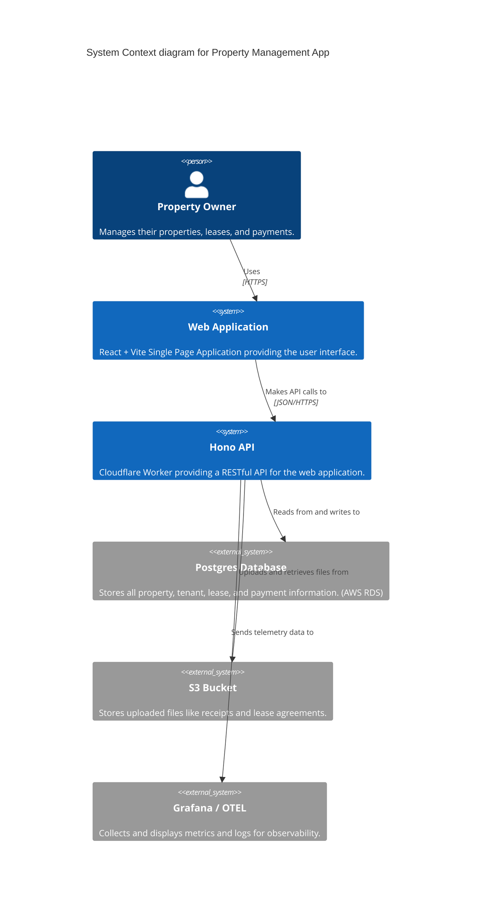

Of course, here is the C4 diagram in Mermaid.js format.

`c4-context-diagram.md`

```mermaid
C4Context
  title System Context diagram for Property Management App

  Person(propertyOwner, "Property Owner", "Manages their properties, leases, and payments.")

  System(spa, "Web Application", "React + Vite Single Page Application providing the user interface.")
  System(api, "Hono API", "Cloudflare Worker providing a RESTful API for the web application.")

  System_Ext(db, "Postgres Database", "Stores all property, tenant, lease, and payment information. (AWS RDS)")
  System_Ext(storage, "S3 Bucket", "Stores uploaded files like receipts and lease agreements.")
  System_Ext(monitoring, "Grafana / OTEL", "Collects and displays metrics and logs for observability.")

  Rel(propertyOwner, spa, "Uses", "HTTPS")
  Rel(spa, api, "Makes API calls to", "JSON/HTTPS")
  Rel(api, db, "Reads from and writes to")
  Rel(api, storage, "Uploads and retrieves files from")
  Rel(api, monitoring, "Sends telemetry data to")
```
